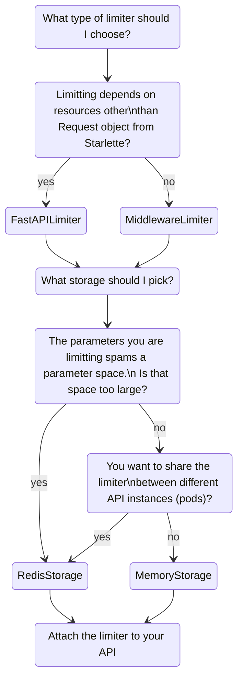

# ThrottledAPI

This repo aims to be an audacious rate limiter for FastAPI. 
Check [our features](tests/acceptance/features/fastapi_limiter.feature) to see the use-cases already tested.

## Why another rate limiter for FastAPI?

Why another rate limiter for FastAPI, if we already have 
[slowapi](https://github.com/laurentS/slowapi) and 
[fastapi-limiter](https://github.com/long2ice/fastapi-limiter)? This limiter glues what is good from both projects and 
adds a bit more. Here is a list of reasons:

- The `throttled-api` rate limiter takes full advantage from the composable dependency injection system in FastAPI. 
That means you can also create limiters per resource.
    - Want to limit requests per IP or per user? Got it! 
    - Want to limit requests based on another weird parameter you are receiving? Just extend our `FastAPILimiter` and you
are good to go!
- You can use different storage storages backends (different implementations for `BaseStorage`) for each limiter.
    - Want to each API instance to 2000 requests per second? You don´t need more than a *in-memory* counter.
Just use `MemoryStorage` for the task.
    - Want to limit calls to all your API instances by user or IP? A shared cache is what you need. 
Our `RedisStorage` implementation is an adapter for the famous `redis` package. Other implementations + asyncio support are comming...

## Instalation

Just use your favorite python package manager. Here are two examples:

- With pip: `pip install throttled`
- With poetry: `poetry add throttled`

## Usage

```python

```

## Middleware vs Dependency

Although FastAPI dependency injection is really powerfull, some limiters doesn´t require any special resource in other to use it.
In that case you cut some latency if using the limiter as a Middleware. To do that, just extend our `MiddlewareLimiter`, which is 
a extension of `FastAPILimiter` to work as a middleware.

### When implementing a custom limiter, how to choose between extending `FastAPILimiter` or `MiddlewareLimiter`?


