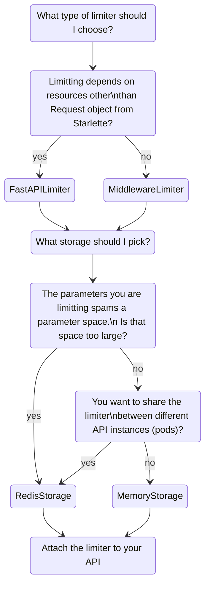

# ThrottledAPI

ThrottledAPI is a rate limiter for FastAPI. 
Check [our features](tests/acceptance/features/fastapi_limiter.feature) to see the use-cases already tested.
Despite only a few acceptance tests, the code base is 99% tested by unit and integration tests. It is also full checked with 
type hints, assuring code great code quality.

## Why another rate limiter for FastAPI?

Why another rate limiter for FastAPI, if we already have 
[slowapi](https://github.com/laurentS/slowapi) and 
[fastapi-limiter](https://github.com/long2ice/fastapi-limiter)? This limiter glues what is good from both projects and 
adds a bit more. Here is a list of reasons:

- The `throttled-api` rate limiter takes full advantage from the composable dependency injection system in FastAPI. 
That means you can also create limiters per resource.
    - Want to limit requests per IP or per user? Got it! 
    - Want to limit requests based on another weird parameter you are receiving? Just extend our `FastAPILimiter` and you
are good to go!
- You can use different storage storages backends (different implementations for `BaseStorage`) for each limiter.
    - Want to each API instance to 2000 requests per second? You don´t need more than a *in-memory* counter.
Just use `MemoryStorage` for the task.
    - Want to limit calls to all your API instances by user or IP? A shared cache is what you need. 
Our `RedisStorage` implementation is an adapter for the famous `redis` package. Other implementations + asyncio support are comming...

## Install

Just use your favorite python package manager. Here are two examples:

- With pip: `pip install throttled`
- With poetry: `poetry add throttled`

## Use

### Use existing limiters

We already implemented `TotalLimiter` and `IPLimiter` for you:

- `TotalLimiter`: limits all calls to your API, so you can assure it won't suffocate with too many requests.
- `IPLimiter`: as the name suggests, limits requests by IP.

### Implement custom limiters

You can implement new limiters easily extending from `FastAPILimiter` or `MiddlewareLimiter`
```python
# Your IDE will help you find the imports

class UserLimiter(FastAPILimiter):
    """Client specific limiter"""

    def __call__(self, request: Request, user: Optional[UserID] = Depends(get_current_user)):
        # The request parameter is mandatory
        self.limit(key=f"username={user.username}")
```

### Attach to the API

There are two options when using the limiters in your API

#### All limiters as dependencies

This is the simplest usage, requiring less code
```python
def create_limiters() -> Sequence[FastAPILimiter]:
    memory = MemoryStorage(cache={})
    api_limiter = TotalLimiter(limit=Rate(2000, 1), storage=memory)
    
    redis = RedisStorage(client=Redis.from_url("redis://localhost:0"))
    ip_limiter = IPLimiter(limit=Rate(10, 1), storage=redis)
    user_limiter = UserLimiter(limit=Rate(2, 5), storage=redis)
    
    return api_limiter, ip_limiter, user_limiter


def create_app(limiters: Sequence[FastAPILimiter] = tuple()) -> FastAPI:
    """Creates a FastAPI app with attached limiters and routes"""
    api = FastAPI(title="Snacks bar", dependencies=limiters)

    api.include_router(products_router, prefix="/products")
    api.include_router(users_router, prefix="/users")
    return api


app = create_app(limiters=create_limiters())
```

#### Some limiters as middlewares

Although FastAPI dependency injection is really powerfull, some limiters doesn´t require any special resource in 
other to do their job. In that case you cut some latency if using the limiter as a Middleware. 
```python
def create_app(limiters: Sequence[FastAPILimiter] = tuple()) -> FastAPI:
    """Creates a FastAPI app with attached limiters and routes"""
    dependencies, middlewares = split_dependencies_and_middlewares(*limiters)

    api = FastAPI(title="Snacks bar", dependencies=dependencies)

    api.include_router(products_router, prefix="/products")
    api.include_router(users_router, prefix="/users")

    for mid in middlewares:
        api.add_middleware(BaseHTTPMiddleware, dispatch=mid)
        
    return api


app = create_app(limiters=create_limiters())  # create_limiter: same function above
```

## Middleware vs Dependency

When implementing a custom limiter, how to choose between extending `FastAPILimiter` or `MiddlewareLimiter`?


